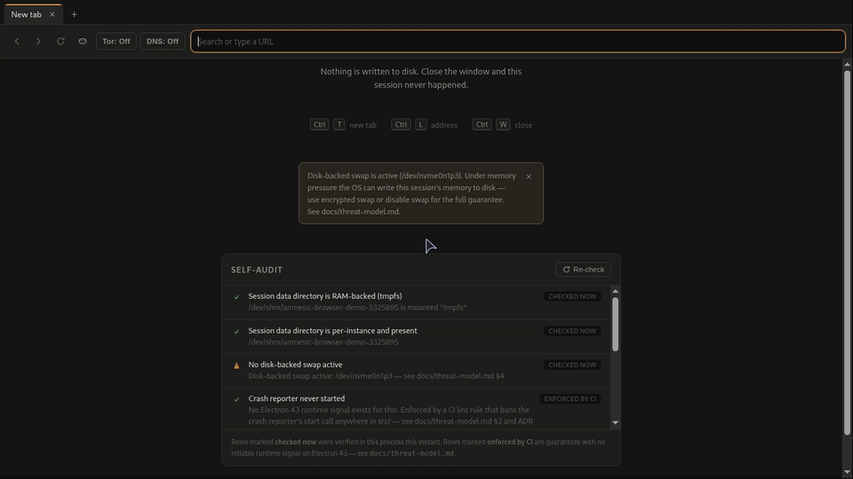
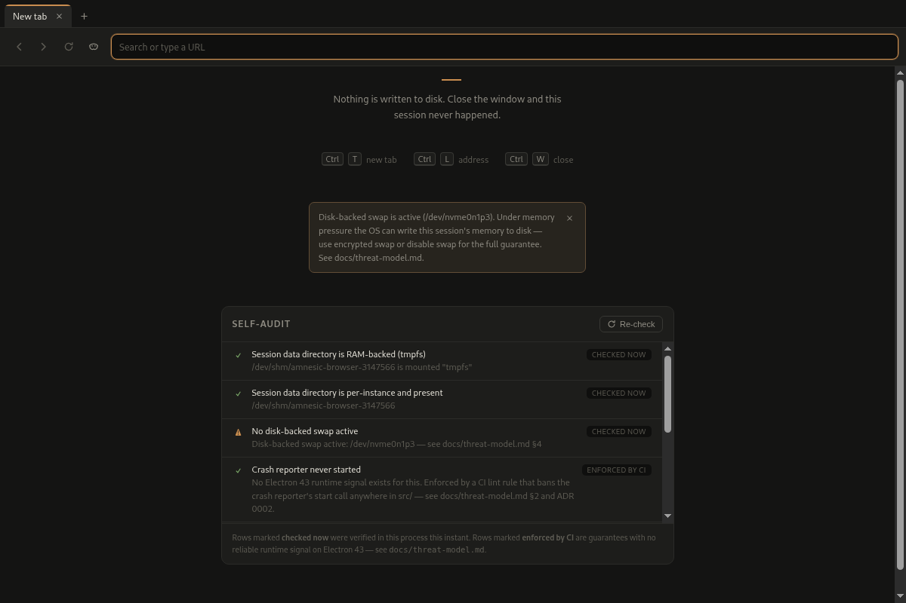

<p align="center">
  
</p>

# Amnesic Browser

<p align="center">
  <a href="https://github.com/Otto-Deviant1904/Amnesic/actions/workflows/ci.yml"></a>
  <a href="https://github.com/Otto-Deviant1904/Amnesic/releases/latest"></a>
  <a href="LICENSE"></a>
</p>

A desktop app that behaves like a normal tabbed browser but is engineered so
that nothing recoverable is left on disk once the process exits — no
history, no cookies, no cache, no OS-level breadcrumbs from the app itself.
And it doesn't just claim that: a scripted session that deliberately tries
to persist data through every mechanism in the threat model, followed by a
filesystem diff, runs in CI on every push.

<p align="center">
  
</p>

## What's protected — and what isn't

| ✅ Protected (verified)                                                                                  | ❌ Not protected (by design, documented)                                      |
| -------------------------------------------------------------------------------------------------------- | ----------------------------------------------------------------------------- |
| Cookies, LocalStorage, IndexedDB, Cache API, service workers — memory-only, never on disk                | Website fingerprinting/tracking during a session (use Tor Browser)            |
| Chromium's profile residue (`Local State`, GPU caches, crash dumps, spellcheck dicts)                    | Live RAM forensics while the app runs (true of every browser)                 |
| Non-Chromium caches (Mesa shaders, fontconfig) — swept into RAM-backed paths                             | OS swap/hibernation leaking page content (the app warns; can't prevent)       |
| Downloads, popups, referrer leakage, WebRTC IP leakage (layered)                                         | Residue from a _crash_ before reboot (tmpfs — gone at reboot)                 |
| Network-level observers — opt-in, fail-closed proxy (Tor/SOCKS5 default, or HTTP/HTTPS) + DNS-over-HTTPS | Anonymity parity with Tor Browser (no uniform fingerprint); a system-wide VPN |

This is not a general-purpose "private browsing" claim. It is a specific,
narrow, and verifiable one: **read [docs/threat-model.md](docs/threat-model.md)
before trusting anything about what this app does or doesn't protect
against.** That document lists, mechanism by mechanism, what's actually
mitigated and what isn't — including the things this project cannot fix
(OS swap/hibernation, live RAM forensics, website fingerprinting). Network-
level observers are now _partially_ addressed — off by default, opt-in per
session — see [Network privacy](#network-privacy-optional) below. For the
full story of how it's built and verified — including the wrong turns —
see [the technical write-up](docs/blog/zero-footprint-browser.md).

## Status

v1 — Linux only. Single-window, in-memory-session tabbed browsing with a
hard-exit cleanup routine. `scripts/verify_footprint.sh` (the empirical
proof of the core claim — a scripted session followed by a filesystem
diff) runs in CI on every push and must pass before any PR touching
session/storage/cache handling merges (see `CLAUDE.md` and ADR 0004).

## Installing

Download the AppImage and `SHA256SUMS` from the
[releases page](https://github.com/Otto-Deviant1904/Amnesic/releases),
verify, and run:

```sh
sha256sum -c SHA256SUMS
chmod +x amnesic-browser-*.AppImage
./amnesic-browser-*.AppImage
```

There is deliberately **no auto-updater** — an amnesic browser should not
phone home, even to itself. To update, download the next release and
verify its checksum (ADR 0006).

Launching a second instance hands its URLs to the running window and
exits; the app registers as an `http(s)` handler so it can be set as the
default browser.

**Sandbox note:** unlike most Electron AppImages, this one does **not**
ship `--no-sandbox` — a browser must not run hostile web content outside
the Chromium OS sandbox. It uses the kernel's unprivileged user
namespaces, available on most modern distros. On Ubuntu 23.10+ (which
restricts unprivileged userns by default) the app will refuse to start
rather than run unsandboxed. The preferred fix is the AppArmor profile in
[`packaging/apparmor/`](packaging/apparmor/), which grants `userns` to
Amnesic alone; only as a last resort run
`sysctl kernel.apparmor_restrict_unprivileged_userns=0`, which relaxes that
restriction system-wide for every unprivileged process, at your own risk.

## Why the claims are verified, not asserted

Every Chromium command-line switch and Electron session API this project
relies on was checked against the exact pinned Electron version
(`electron@43.0.0`, Chromium 150.0.7871.46) rather than trusted from
general knowledge or older tutorials — flags and APIs change between
releases. See `research/` for the verification notes and
`docs/adr/` for the architectural decisions and corrections that came out
of that process.

The start page also carries a **self-audit panel** that runs a set of live
checks in the main process every time you open it (or press "Re-check") —
turning the CI-only trust story into something you can watch happen in your
own running instance, not just read about:

<p align="center">
  
</p>

Every row is honest about what it actually proved: rows marked **checked
now** were verified in that exact process at that exact moment (tmpfs
filesystem type, the session partition's name, the HTTP-cache switch, …);
rows marked **enforced by CI** are guarantees with no reliable Electron 43
runtime signal (the crash-reporter guarantee, for one — see
`research/cleanup-and-exit.md` §21) and are labeled as such rather than
faked as a runtime check.

## Using it

New tabs open on an in-app start page; the address bar accepts URLs or
search terms (searches go to DuckDuckGo). `target=_blank` links and
ctrl+click open as new tabs in the same hardened in-memory session —
real popup windows are never created. Closing the last tab closes the
window, which triggers the wipe-and-exit routine.

Everyday browsing niceties are in and stay inside the amnesic envelope:
right-click context menus (page, links, images, selections, address bar),
find in page (`Ctrl+F`), session-only tab favicons (fetched through the
tab's in-memory session, never by the shell), drag-to-reorder tabs, an
audio indicator with click-to-mute, and a zoom chip in the address bar
when zoom ≠ 100%. HTML5 fullscreen (video players) works; all other
permission requests remain denied. Failed loads — DNS errors, refused
connections, invalid certificates — render an in-shell error page with a
retry button; there is deliberately **no** "proceed anyway" bypass for bad
certificates. Sites behind HTTP basic auth get an in-shell sign-in dialog;
credentials go only into the request and are forgotten with the session.

Two shortcuts reach the same wipe machinery from a different angle: the
**panic key** (`Ctrl+Shift+Q`) runs the exact wipe-and-exit routine that
closing the last tab does, from anywhere — address bar, page content, or the
find bar — and quits immediately. **New identity** (`Ctrl+Shift+N`, or the
mask icon in the toolbar) closes every open tab and rotates to a brand-new,
freshly hardened in-memory session without restarting the app — a Tor
Browser-style forensic reset mid-session (see ADR 0009).

**Containers** (the containers chip in the toolbar) is an opt-in, off-by-
default toggle that gives each new tab its own isolated session — a cookie or
`localStorage` entry set in one tab is invisible to another, so trackers can't
correlate the tabs you deliberately keep apart. It only affects tabs you open
_after_ turning it on; tabs already open keep their session, and links a page
opens itself (pop-ups, `target=_blank`) stay in that page's container so
logins don't break. Honest limits: this isolates tabs from each other, **not**
sites within a tab (it is per-tab, not per-site/first-party isolation), every
tab still shares one IP, and fingerprinting can still correlate across tabs.
Session-only, never persisted (see [ADR 0011](docs/adr/0011-containers-per-tab-sessions.md)).

| Shortcut                       | Action                                                                         |
| ------------------------------ | ------------------------------------------------------------------------------ |
| `Ctrl+T` / `Ctrl+W`            | new / close tab                                                                |
| `Ctrl+Tab`, `Ctrl+PgUp/PgDn`   | cycle tabs                                                                     |
| `Ctrl+1…8`, `Ctrl+9`           | nth / last tab                                                                 |
| `Ctrl+L`                       | focus address bar                                                              |
| `Ctrl+F`                       | find in page (`Enter`/`Shift+Enter` cycle, `Esc` closes)                       |
| `Ctrl+R`, `F5`, `Ctrl+Shift+R` | reload (hard)                                                                  |
| `Alt+←` / `Alt+→`              | back / forward                                                                 |
| `Ctrl+=` / `Ctrl+-` / `Ctrl+0` | zoom in / out / reset                                                          |
| `Esc`                          | stop loading (or revert address bar while typing)                              |
| `Ctrl+Shift+Q`                 | **panic key** — wipe session and quit immediately, from anywhere in the window |
| `Ctrl+Shift+N`                 | **new identity** — close all tabs, rotate to a fresh session, without quitting |

## Network privacy (optional)

Local footprint elimination and network-level privacy are separate
problems; the browser's core claim was always about the first. Two
opt-in, session-only toggles now address a slice of the second — both are
**off by default on every launch** and never persisted, matching the
project's no-persisted-settings rule.

**Proxy (the shield chip in the toolbar) — Tor by default, any proxy you
run.** Bring your own proxy: point the browser at one already running on
your machine or network and the toggle connects tab traffic through it.
Three schemes:

- **Tor / SOCKS5** — the one-click default (`127.0.0.1:9050`, pre-filled),
  for a local Tor instance (Tor Browser, the system `tor` service, or your
  own `tor` process). This is the flagship and what the shield presents
  first.
- **HTTP** and **HTTPS** — for a VPN or other provider's proxy. Pick the
  scheme, set host/port, done.

For **all three** the hostname resolves at the proxy, never locally, and —
critically — an unreachable proxy fails navigation **closed** rather than
silently falling back to a direct connection. SOCKS4 is deliberately not
offered: it would leak every hostname to your local resolver. Read
[ADR 0007](docs/adr/0007-tor-socks-proxy-integration.md) and
[ADR 0012](docs/adr/0012-general-proxy-schemes.md) for the full design.

Honest, per scheme: **Tor / SOCKS5** uses a relay model, so no single
operator sees both your real IP and your destinations. An **HTTP/HTTPS
proxy is one operator** — your VPN endpoint — who sees your real IP and
can correlate all your traffic. That is transport privacy, **not**
anonymity and **not** anti-fingerprinting; an HTTP proxy is never as
private as Tor. Across all schemes this is footprint elimination plus
transport privacy, not anonymity parity with Tor Browser — no uniform
fingerprint, no circuit-health control-port integration, and New Identity
under a proxy only rotates the browser's own session, never requests a
fresh circuit. A full **system** VPN (a TUN device routing your whole
machine, needing root and a bundled tunnel) is out of scope — this is the
browser routing its own traffic, nothing more.

**DNS-over-HTTPS** (the DNS chip next to it) — independent of the proxy,
forces encrypted DNS to Quad9 or Mullvad (no Google or Cloudflare option,
no free-text server field — see [ADR 0010](docs/adr/0010-dns-over-https-toggle.md)
for why). While any proxy is on, this control greys out with an
explanation: tab DNS already resolves at the proxy in that case, so
changing the local resolver has no visible effect on proxied traffic — but
your selection is preserved underneath, not reset, so turning the proxy
back off picks up right where you left it.

Both toggles are verified end-to-end against hand-rolled, hermetic proxy
test servers — SOCKS5 and HTTP (`tests/e2e/proxy.spec.ts`,
`tests/e2e/dns.spec.ts`) — never a real Tor instance, VPN, or network
egress in CI, and the HTTP tests prove the destination hostname reaches
the proxy **unresolved** (no local DNS leak). One honestly un-asserted
limit: neither suite proves at the packet level that DNS queries leave the
process as HTTPS rather than plaintext port 53 — that needs root/netns
packet capture this project's CI doesn't have. See `docs/threat-model.md`'s
DNS row for the manual `tcpdump`-based check a maintainer can run for that
stronger guarantee.

## Development

```sh
npm install
npm run dev      # electron-vite dev server + app
npm run build    # production build
npm run typecheck
npm run lint
npm test         # vitest unit tests
npm run test:e2e # playwright e2e tests
npm run dist     # package the Linux AppImage into dist/
```

Releases are cut by pushing a `v*` tag: CI re-runs the full quality gate,
builds the AppImage, and drafts a GitHub release with a `SHA256SUMS` file
(`.github/workflows/release.yml`). The app icon is generated from
`build/icon.svg` by `scripts/generate_icon.sh` — edit the SVG, never the
PNGs.

## Contributing

See [CONTRIBUTING.md](CONTRIBUTING.md) — the short version: the product is
a verified guarantee, so PRs pass the full quality gate (typecheck, lint
greps, unit, e2e, footprint verifier), new subsystems must be exercised by
the verifier in the same PR, and every Chromium switch or Electron API is
verified against the pinned version with a note in `research/`. Issues
labeled `good first issue` are scoped to be landable without touching
guarantee-bearing code.

## Non-goals for v1

See `CLAUDE.md`. Anti-fingerprinting, extensions, bookmarks, downloads,
password/autofill management, and any telemetry are explicitly out of
scope and require explicit approval before being added. (Tor/SOCKS
integration was on this list before v0.3.0 — see "Network privacy" above.)

## License

[APACHE 2.0](LICENSE)
